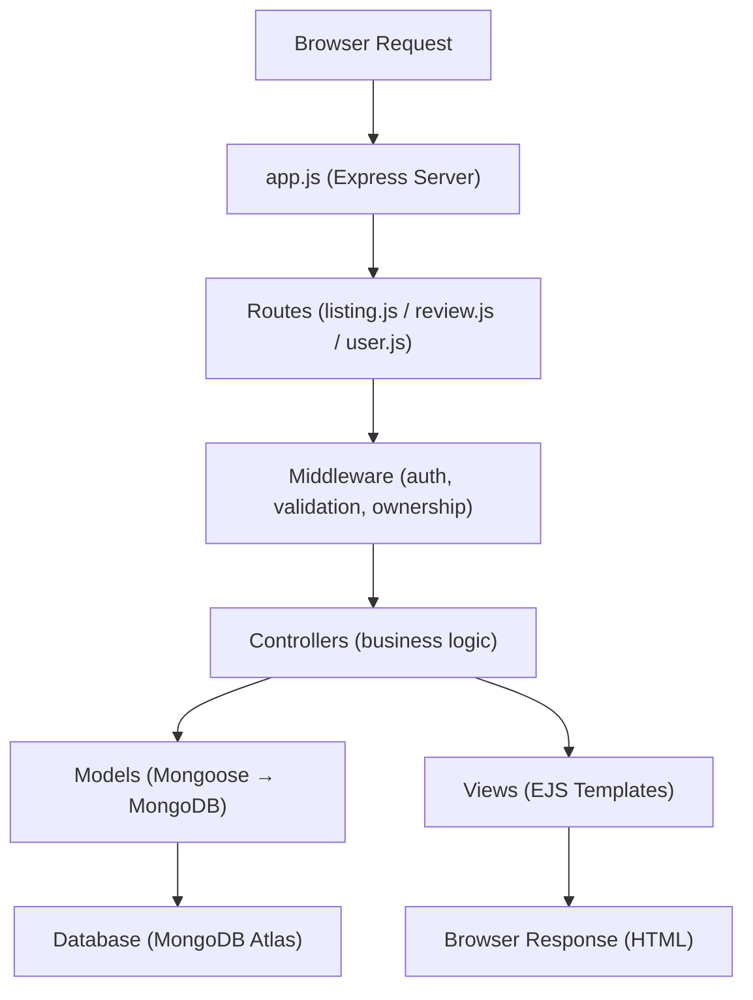

# WonderLust — AirBNB Clone: Project Overview

## Tech Stack

| Layer | Technology | Purpose |
|-------|-----------|---------|
| **Runtime** | Node.js (v22.12.0) | Server-side JavaScript runtime |
| **Framework** | Express.js (v5) | Web application framework, routing, middleware |
| **Database** | MongoDB Atlas | Cloud NoSQL database |
| **ODM** | Mongoose (v8) | MongoDB object modeling & schema validation |
| **Templating** | EJS + ejs-mate | Server-side HTML rendering with layouts |
| **Authentication** | Passport.js + passport-local-mongoose | User login/signup with session-based auth |
| **Sessions** | express-session + connect-mongo | Session storage backed by MongoDB |
| **Validation** | Joi | Server-side request body validation |
| **Image Upload** | Multer + Cloudinary | File upload middleware + cloud image storage |
| **Maps** | Mapbox SDK | Forward geocoding (location → coordinates) |
| **Flash Messages** | connect-flash | One-time success/error notifications |
| **HTTP Methods** | method-override | Support PUT/DELETE from HTML forms |

---

## Directory Structure

```
MajorProjectAirBNB/
├── app.js                  # 🚀 Entry point — Express server setup
├── cloudConfig.js          # ☁️ Cloudinary + Multer storage config
├── middleware.js            # 🔒 Auth, ownership & validation middleware
├── schema.js               # ✅ Joi validation schemas
├── .env                    # 🔑 Environment variables (secrets)
├── .gitignore              # Git ignore rules
├── package.json            # Dependencies & project metadata
│
├── models/                 # 📦 Mongoose Schemas (Data Layer)
│   ├── listing.js          #    Listing schema (title, price, location, image, geometry, reviews, owner)
│   ├── review.js           #    Review schema (comment, rating, author)
│   └── user.js             #    User schema (email + passport-local-mongoose plugin)
│
├── routes/                 # 🛣️ Express Routers (Route Layer)
│   ├── listing.js          #    /listings routes (CRUD)
│   ├── review.js           #    /listings/:id/reviews routes (create, delete)
│   └── user.js             #    /signup, /login, /logout routes
│
├── controllers/            # 🎮 Business Logic (Controller Layer)
│   ├── listings.js         #    Listing CRUD handlers + geocoding
│   ├── reviews.js          #    Review create/delete handlers
│   └── users.js            #    Signup, login, logout handlers
│
├── views/                  # 🖼️ EJS Templates (View Layer)
│   ├── layouts/
│   │   └── boilerplate.ejs #    Main HTML layout (head, body wrapper)
│   ├── includes/
│   │   ├── navbar.ejs      #    Navigation bar
│   │   ├── footer.ejs      #    Footer
│   │   └── flash.ejs       #    Flash message display
│   ├── listings/
│   │   ├── index.ejs       #    All listings page (homepage)
│   │   ├── show.ejs        #    Single listing detail + reviews + map
│   │   ├── new.ejs         #    Create new listing form
│   │   └── edit.ejs        #    Edit listing form
│   ├── users/
│   │   ├── signup.ejs      #    Signup form
│   │   └── login.ejs       #    Login form
│   └── error.ejs           #    Error page
│
├── public/                 # 📁 Static Assets
│   ├── css/
│   │   ├── style.css       #    Main stylesheet
│   │   └── rating.css      #    Star rating styles
│   └── js/
│       ├── script.js       #    Client-side JS (form validation etc.)
│       └── map.js          #    Mapbox map initialization
│
├── utils/                  # 🔧 Utilities
│   ├── ExpressError.js     #    Custom error class (statusCode + message)
│   └── wrapAsync.js        #    Async error wrapper for route handlers
│
└── init/                   # 🌱 Database Seeding
    ├── data.js             #    Sample listing data
    └── index.js            #    Seed script to populate DB
```

---

## Logic Flow (MVC Pattern)

The project follows the **MVC (Model-View-Controller)** architecture:



### Step-by-step Request Flow

#### 1. `app.js` — Server Bootstraps
- Loads `.env` variables (DB URL, Cloudinary keys, Mapbox token, session secret)
- Connects to **MongoDB Atlas** via Mongoose
- Configures **sessions** (stored in MongoDB via `connect-mongo`)
- Initializes **Passport.js** for authentication
- Sets up **global middleware** (flash messages, current user)
- Mounts **routers**:
  - `/listings` → `routes/listing.js`
  - `/listings/:id/reviews` → `routes/review.js`
  - `/signup`, `/login`, `/logout` → `routes/user.js`

#### 2. `routes/` — Defines URL → Handler Mapping

| Route File | URL Pattern | Methods | Key Middleware |
|-----------|-------------|---------|----------------|
| `listing.js` | `/listings` | GET, POST | `isLoggedIn`, `validateListing`, `multer` upload |
| `listing.js` | `/listings/new` | GET | `isLoggedIn` |
| `listing.js` | `/listings/:id` | GET, PUT, DELETE | `isLoggedIn`, `isOwner`, `validateListing` |
| `listing.js` | `/listings/:id/edit` | GET | `isLoggedIn`, `isOwner` |
| `review.js` | `/listings/:id/reviews` | POST | `isLoggedIn`, `validateReview` |
| `review.js` | `/listings/:id/reviews/:reviewId` | DELETE | `isLoggedIn`, `isReviewAuthor` |
| `user.js` | `/signup` | GET, POST | — |
| `user.js` | `/login` | GET, POST | `saveRedirectUrl`, `passport.authenticate` |
| `user.js` | `/logout` | GET | — |

#### 3. `middleware.js` — Guards & Validators
- **`isLoggedIn`** — Checks if user is authenticated, redirects to `/login` if not
- **`saveRedirectUrl`** — Saves the original URL so user returns after login
- **`isOwner`** — Ensures only the listing owner can edit/delete it
- **`isReviewAuthor`** — Ensures only the review author can delete it
- **`validateListing`** — Validates listing data using Joi schema
- **`validateReview`** — Validates review data using Joi schema

#### 4. `controllers/` — Business Logic

| Controller | Key Functions |
|-----------|--------------|
| `listings.js` | `index` (list all), `showListing` (detail), `createListing` (with geocoding + image upload), `renderEditForm`, `updateListing`, `destroyListing` |
| `reviews.js` | `createReview` (add review to listing), `destroyReview` (remove review) |
| `users.js` | `signup` (register + auto-login), `login` (redirect back), `logout` |

#### 5. `models/` — Data Schemas

| Model | Fields | Relationships |
|-------|--------|---------------|
| **Listing** | title, description, price, location, country, image (url + filename), geometry (GeoJSON Point) | Has many Reviews, belongs to User (owner) |
| **Review** | comment, rating (1-5), createdAt | Belongs to User (author) |
| **User** | email (+ username/password via passport plugin) | Owns Listings, authors Reviews |

> **Cascade Delete**: When a listing is deleted, all its associated reviews are automatically removed via a Mongoose `post('findOneAndDelete')` hook.

#### 6. `views/` — EJS Templates
- **`boilerplate.ejs`** — Wraps every page (HTML head, navbar, flash messages, footer)
- **Listing pages** — index (card grid), show (detail + reviews + map), new/edit (forms)
- **User pages** — signup & login forms

#### 7. External Services
- **Cloudinary** (`cloudConfig.js`) — Images are uploaded to the `wanderlust_DEV` folder
- **Mapbox** (`controllers/listings.js`) — Location string is geocoded to lat/lng coordinates for map display
- **MongoDB Atlas** — All data is stored in the cloud
