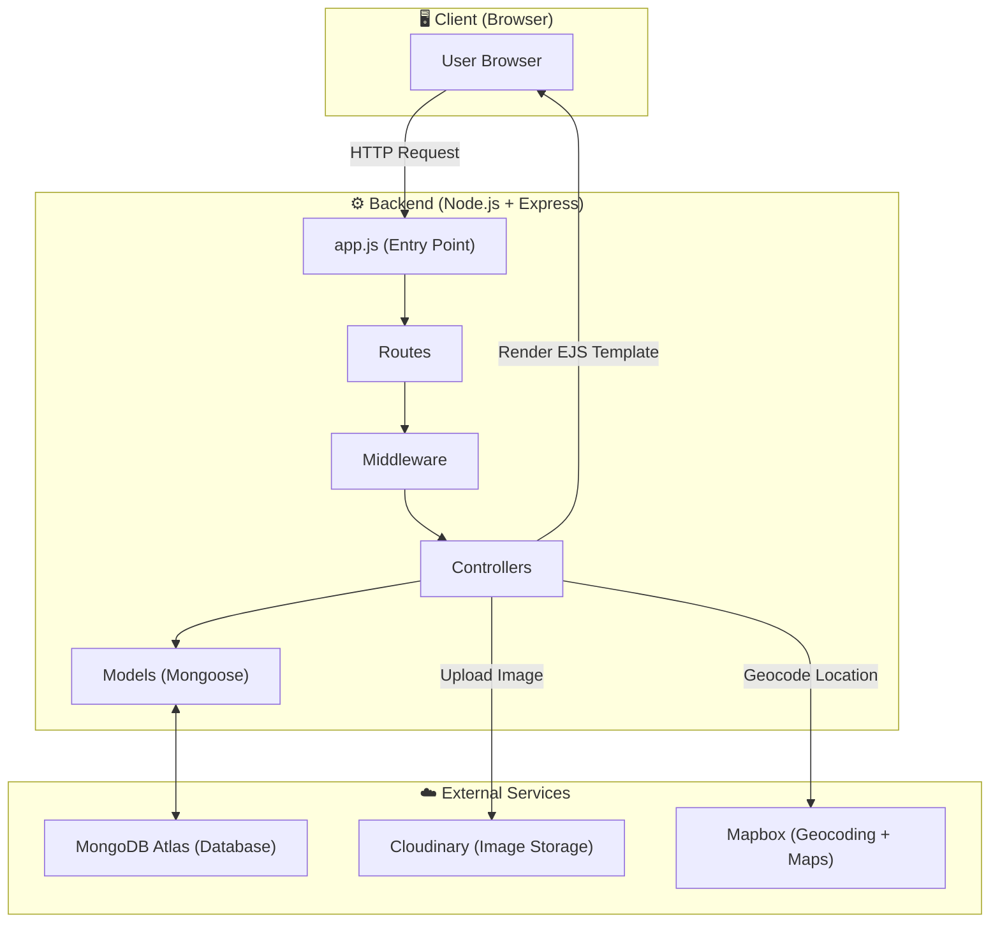
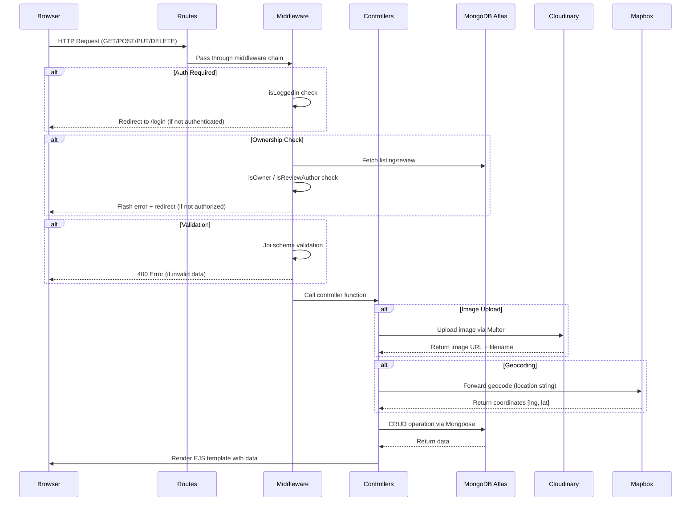
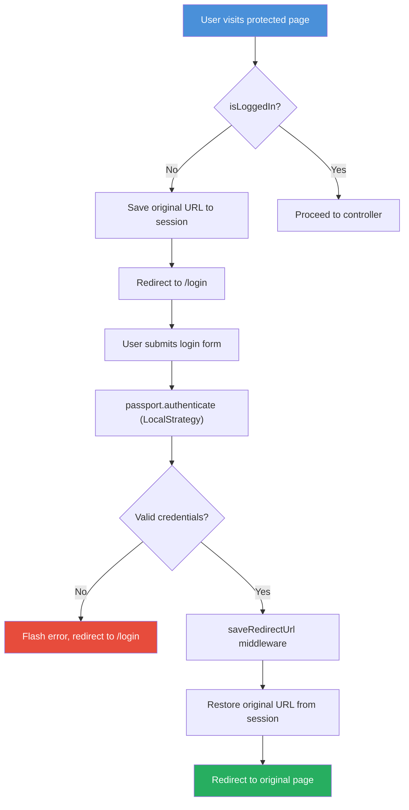
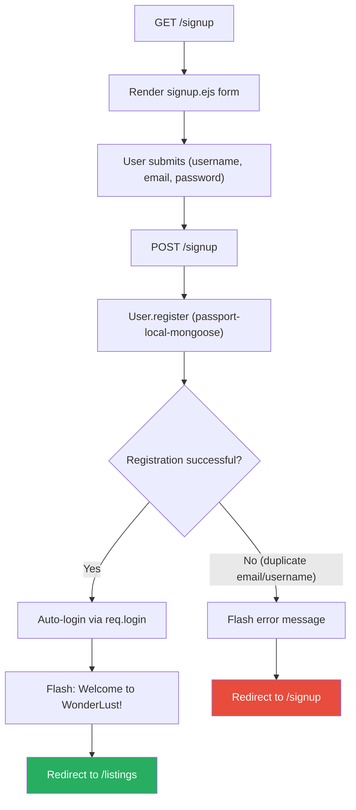
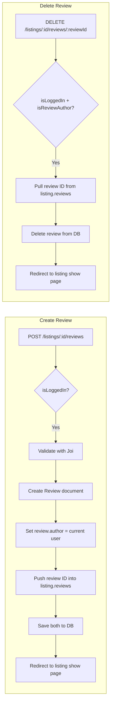
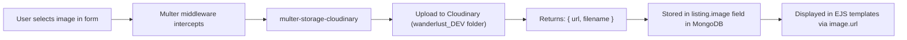
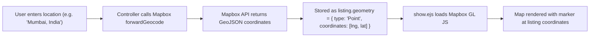
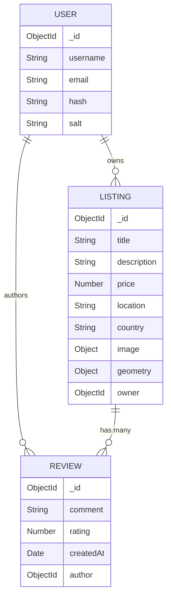

# WonderLust (AirBNB Clone) — System Flow Diagrams

## 1. High-Level System Architecture

---

## 2. Request-Response Lifecycle

---

## 3. User Authentication Flow

---

## 4. Signup Flow

---

## 5. Listing CRUD Flow

```mermaid
flowchart TD
    subgraph INDEX["View All Listings"]
        A1["GET /listings"] --> A2["Fetch all listings from DB"]
        A2 --> A3["Render index.ejs (card grid)"]
    end

    subgraph CREATE["Create Listing"]
        B1["GET /listings/new"] --> B2{"isLoggedIn?"}
        B2 -- "Yes" --> B3["Render new.ejs form"]
        B3 --> B4["POST /listings (with image)"]
        B4 --> B5["Multer uploads image to Cloudinary"]
        B5 --> B6["Mapbox geocodes location → coordinates"]
        B6 --> B7["Save listing to MongoDB"]
        B7 --> B8["Flash success, redirect to /listings"]
    end

    subgraph SHOW["View Single Listing"]
        C1["GET /listings/:id"] --> C2["Fetch listing + populate reviews + owner"]
        C2 --> C3["Render show.ejs (details + map + reviews)"]
    end

    subgraph UPDATE["Edit Listing"]
        D1["GET /listings/:id/edit"] --> D2{"isLoggedIn + isOwner?"}
        D2 -- "Yes" --> D3["Render edit.ejs (prefilled form)"]
        D3 --> D4["PUT /listings/:id"]
        D4 --> D5["Update listing in DB"]
        D5 --> D6["Flash success, redirect to show page"]
    end

    subgraph DELETE["Delete Listing"]
        E1["DELETE /listings/:id"] --> E2{"isLoggedIn + isOwner?"}
        E2 -- "Yes" --> E3["Delete listing from DB"]
        E3 --> E4["Cascade: delete all associated reviews"]
        E4 --> E5["Flash success, redirect to /listings"]
    end
```

---

## 6. Review Flow

---

## 7. Image Upload Flow

---

## 8. Geocoding + Map Flow

---

## 9. Data Model Relationships

---

## 10. Middleware Pipeline

```mermaid
flowchart LR
    A["Incoming Request"] --> B["express.urlencoded"]
    B --> C["method-override"]
    C --> D["express-session"]
    D --> E["connect-flash"]
    E --> F["passport.initialize"]
    F --> G["passport.session"]
    G --> H["Set res.locals (currUser, flash msgs)"]
    H --> I["Route-specific middleware"]
    
    subgraph ROUTE_MW["Route Middleware (as needed)"]
        I --> J["isLoggedIn"]
        J --> K["isOwner / isReviewAuthor"]
        K --> L["validateListing / validateReview"]
        L --> M["multer (image upload)"]
    end
    
    M --> N["Controller"]
```

